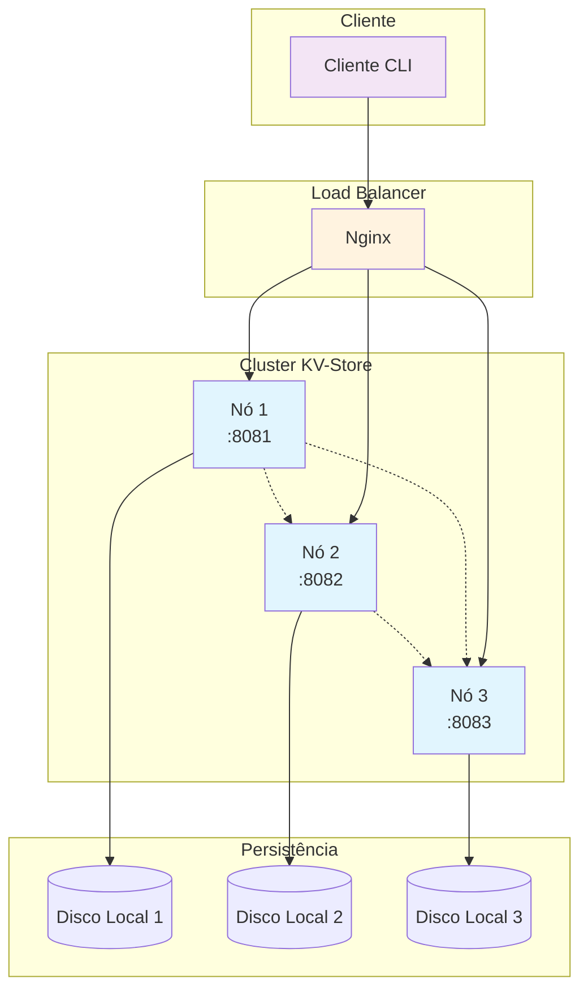
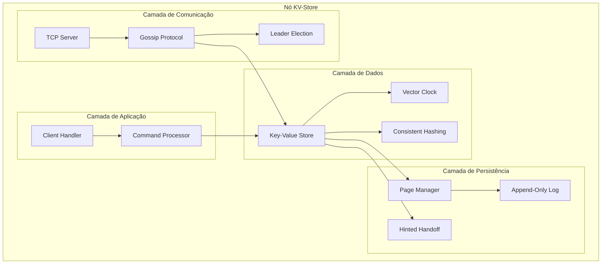
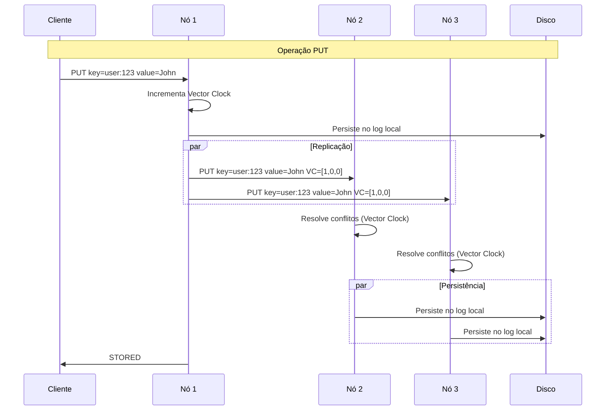
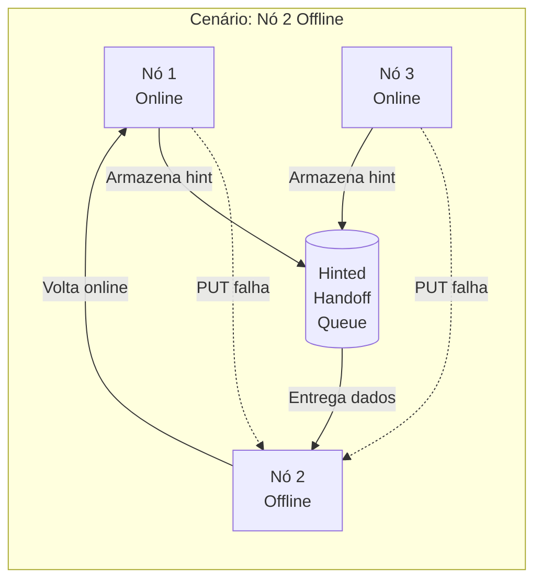
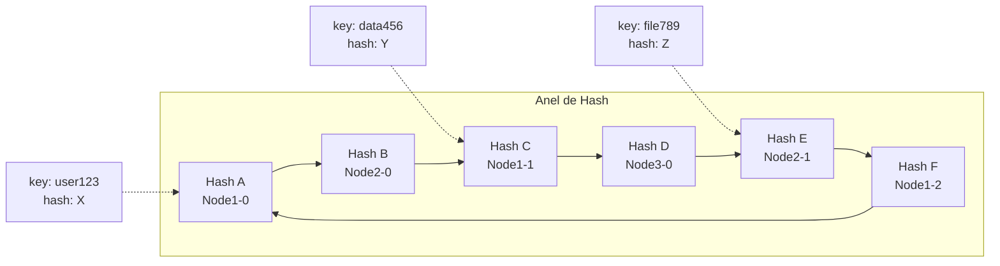
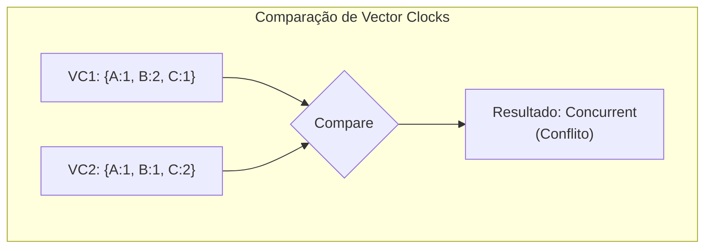
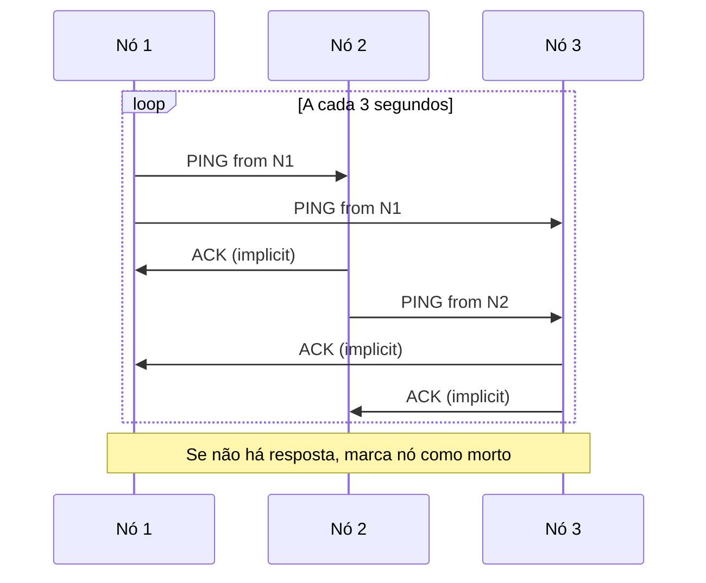
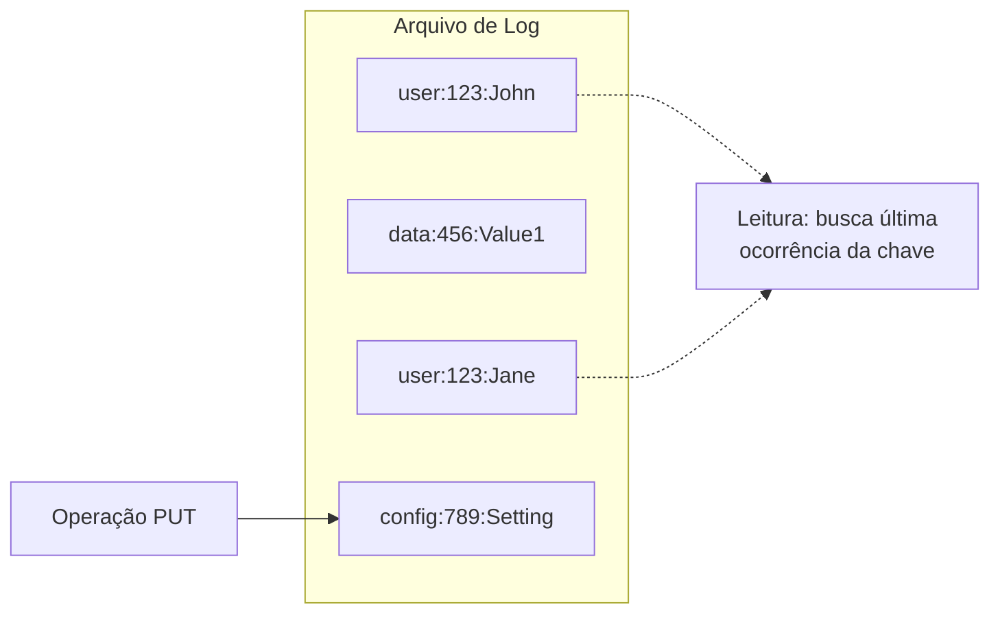
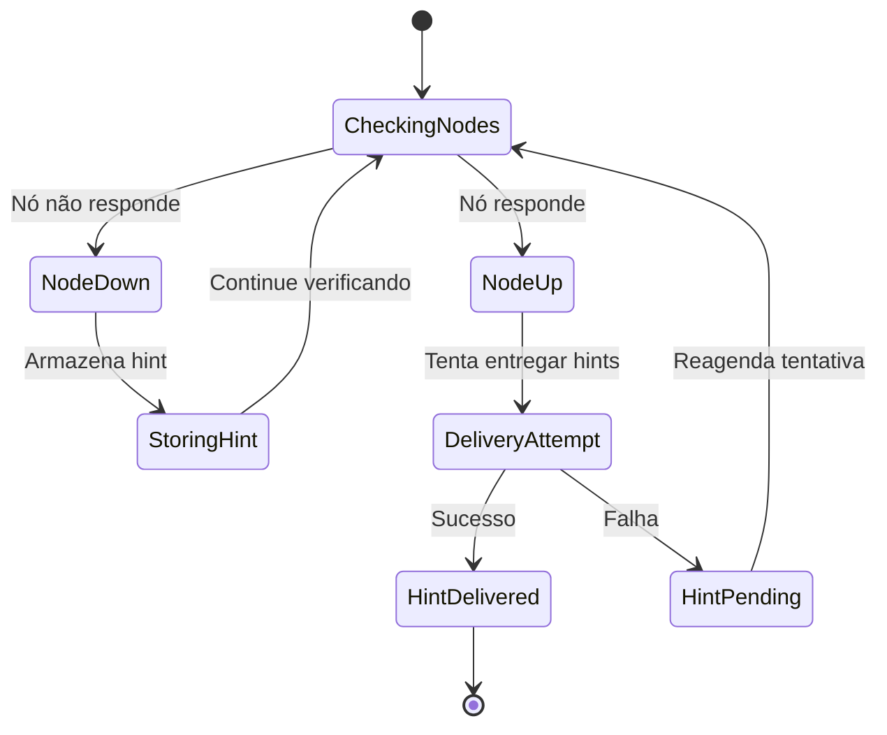
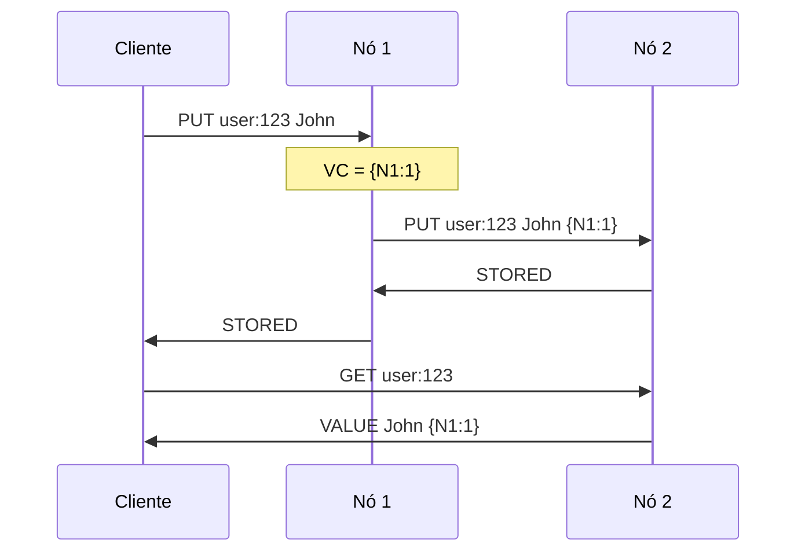

# Documentação de Arquitetura - KV-Store Distribuído

## Visão Geral

Este documento descreve a arquitetura do sistema de Key-Value Store distribuído implementado em Go, que utiliza Gossip Protocol para comunicação entre nós, Consistent Hashing para distribuição de dados, Vector Clocks para controle de versões e Hinted Handoff para tolerância a falhas.

## Índice

1. [Nível 1 - Arquitetura de Alto Nível](#nível-1---arquitetura-de-alto-nível)
2. [Nível 2 - Arquitetura de Componentes](#nível-2---arquitetura-de-componentes)
3. [Nível 3 - Arquitetura de Implementação](#nível-3---arquitetura-de-implementação)

---

## Nível 1 - Arquitetura de Alto Nível

### Visão Geral do Sistema

O sistema é um Key-Value Store distribuído que permite armazenamento e recuperação de dados através de múltiplos nós, garantindo alta disponibilidade, tolerância a falhas e eventual consistência.



### Características Principais

- **Distribuição**: Dados distribuídos entre múltiplos nós usando Consistent Hashing
- **Replicação**: Cada chave é replicada em todos os nós do cluster
- **Tolerância a Falhas**: Sistema continua operacional mesmo com falha de nós
- **Eventual Consistência**: Utilizando Vector Clocks para resolução de conflitos
- **Auto-recuperação**: Hinted Handoff para entrega de dados quando nós voltam online

### Fluxo de Operações Básicas

#### Operação PUT
1. Cliente envia requisição PUT através do load balancer
2. Nó receptor armazena localmente e replica para todos os outros nós
3. Dados são persistidos em disco local (append-only log)
4. Vector Clock é incrementado para controle de versão

#### Operação GET
1. Cliente envia requisição GET através do load balancer
2. Nó tenta buscar localmente primeiro
3. Se não encontrado, consulta outros nós do cluster
4. Retorna valor com Vector Clock para controle de versão

---

## Nível 2 - Arquitetura de Componentes

### Componentes Principais



### Detalhamento dos Componentes

#### 1. Gossip Protocol (`internal/store/gossip.go`)
- **Responsabilidade**: Comunicação peer-to-peer entre nós
- **Funcionalidades**:
  - Health checking (PING/PONG)
  - Propagação de operações PUT/GET
  - Detecção de falhas de nós
  - Leader election (algoritmo Bully)

#### 2. Key-Value Store (`internal/store/kvstore.go`)
- **Responsabilidade**: Gerenciamento de dados e operações
- **Funcionalidades**:
  - Armazenamento em memória e disco
  - Resolução de conflitos com Vector Clocks
  - Replicação entre nós
  - Hinted Handoff para tolerância a falhas

#### 3. Consistent Hashing (`internal/store/hashing.go`)
- **Responsabilidade**: Distribuição de chaves entre nós
- **Funcionalidades**:
  - Mapeamento de chaves para nós usando SHA-1
  - Suporte a nós virtuais (vNodes) para balanceamento
  - Adição/remoção dinâmica de nós

#### 4. Vector Clock (`internal/vectorclock/vectorclock.go`)
- **Responsabilidade**: Controle de versões distribuído
- **Funcionalidades**:
  - Ordenação parcial de eventos
  - Detecção e resolução de conflitos
  - Serialização/deserialização para rede

### Fluxo de Dados Detalhado



### Tolerância a Falhas



---

## Nível 3 - Arquitetura de Implementação

### Estrutura de Código

```
kv-golang/
├── cmd/
│   ├── client/main.go      # Cliente CLI interativo
│   └── server/main.go      # Servidor principal
├── internal/
│   ├── store/
│   │   ├── gossip.go       # Protocolo Gossip
│   │   ├── kvstore.go      # Armazenamento K-V
│   │   ├── hashing.go      # Consistent Hashing
│   │   └── persistence.go  # Gerenciamento de páginas
│   └── vectorclock/
│       └── vectorclock.go  # Vector Clock
└── main.go                 # Ponto de entrada legacy
```

### Estruturas de Dados Principais

#### DataItem
```go
type DataItem struct {
    Value       string
    VectorClock *vectorclock.VectorClock
}
```

#### Hint (para Hinted Handoff)
```go
type Hint struct {
    Key         string
    Value       string
    TargetID    string
    Timestamp   time.Time
    VectorClock *vectorclock.VectorClock
}
```

#### Node
```go
type Node struct {
    ID        string
    Address   string
    Alive     bool
    LastCheck time.Time
}
```

### Algoritmos Implementados

#### 1. Algoritmo de Hash Consistente



**Implementação:**
```go
func (ch *ConsistentHashing) GetNode(key string) *Node {
    hash := ch.HashFunction(key)
    idx := sort.Search(len(ch.SortedHashes), func(i int) bool {
        return ch.SortedHashes[i] >= hash
    })
    if idx == len(ch.SortedHashes) {
        idx = 0
    }
    return ch.HashMap[ch.SortedHashes[idx]]
}
```

#### 2. Vector Clock Comparison



**Algoritmo de Comparação:**
```go
func (vc *VectorClock) Compare(other *VectorClock) int {
    isLess := false
    isGreater := false
    
    // Compara cada contador
    for nodeID, counter := range vc.Clock {
        if otherCounter, exists := other.Clock[nodeID]; exists {
            if counter < otherCounter {
                isLess = true
            } else if counter > otherCounter {
                isGreater = true
            }
        }
    }
    
    if isLess && !isGreater {
        return -1 // vc é mais antigo
    } else if isGreater && !isLess {
        return 1  // vc é mais recente
    }
    return 0 // Conflito (concurrent)
}
```

#### 3. Gossip Protocol para Health Check



### Persistência de Dados

#### Append-Only Log


**Implementação de Escrita:**
```go
func (kv *KeyValueStore) writeDataToDisk(key, value string) {
    line := key + ":" + value + "\n"
    if kv.LogFile != nil {
        _, err := kv.LogFile.WriteString(line)
        if err != nil {
            slog.Error("Falha ao persistir dado", "key", key, "err", err)
        }
    }
}
```

### Hinted Handoff Implementation



**Implementação do Processamento:**
```go
func (kv *KeyValueStore) processHintedHandoff() {
    for key, hints := range kv.HintedData {
        for targetID, hint := range hints {
            if kv.Gossip.IsNodeAlive(targetID) {
                if node, ok := kv.Gossip.Nodes[targetID]; ok {
                    kv.Gossip.sendPutToNode(node, hint.Key, hint.Value, hint.VectorClock)
                }
                delete(hints, targetID)
            }
        }
    }
}
```

### Protocolos de Comunicação

#### Formato de Mensagens TCP

```
PUT <key> <value> <vector_clock>
GET <key>
PING from <node_id>
NODES
ELECTION from <node_id>
COORDINATOR <node_id>
```

#### Exemplo de Troca de Mensagens



### Configuração e Deploy

#### Docker Compose Setup
```yaml
services:
  node1:
    build: .
    command: ["node1", "8081"]
    networks: [kvnet]
  
  nginx:
    image: nginx:alpine
    ports: ["8080:8080"]
    volumes: ["./nginx.conf:/etc/nginx/nginx.conf:ro"]
    networks: [kvnet]
```

#### Nginx Load Balancer Config
```nginx
upstream kvstore {
    server node1:8081;
    server node2:8082;
    server node3:8083;
}

server {
    listen 8080;
    location / {
        proxy_pass http://kvstore;
    }
}
```

### Métricas e Monitoramento

O sistema implementa logging estruturado usando `slog` para:

- **Health Checks**: Status dos nós e detecção de falhas
- **Operações de Dados**: PUT/GET com timestamps e Vector Clocks
- **Replicação**: Sucesso/falha na propagação entre nós
- **Hinted Handoff**: Entrega de dados pendentes
- **Eleição de Líder**: Mudanças de coordenador

### Limitações e Considerações

1. **Consistência**: Sistema oferece eventual consistência, não forte consistência
2. **Particionamento de Rede**: Não implementa algoritmos para split-brain
3. **Compactação**: Log append-only pode crescer indefinidamente
4. **Segurança**: Não implementa autenticação/autorização
5. **Performance**: Replicação para todos os nós pode não escalar bem

### Futuras Melhorias

1. **Quorum-based Replication**: Implementar R/W/N tunáveis
2. **Anti-Entropy**: Reconciliação periódica entre nós
3. **Compactação de Log**: Limpeza de entradas antigas
4. **Merkle Trees**: Para sincronização eficiente
5. **Instrumentação**: Métricas Prometheus/Grafana
