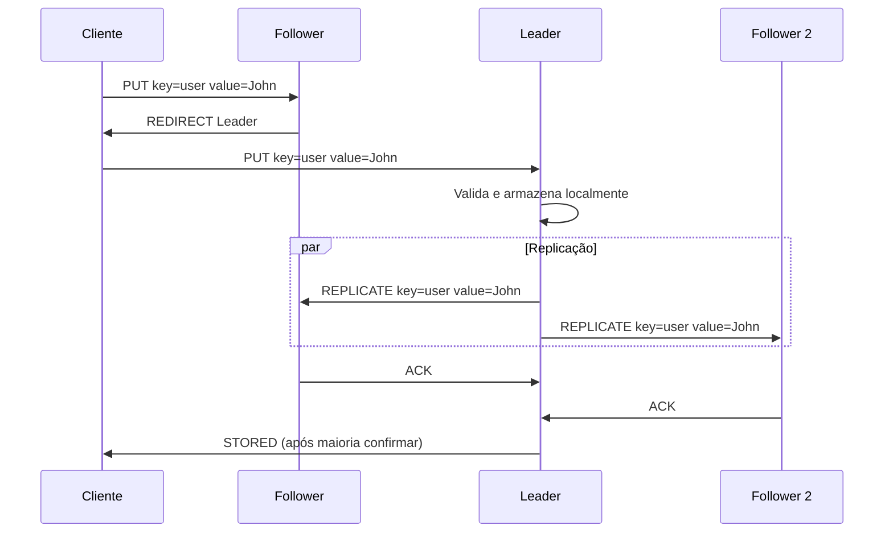
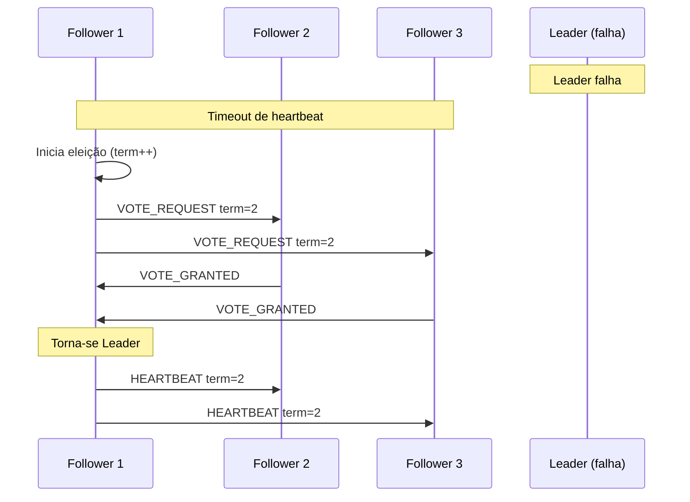

# Proposta de Implementação: Modo Leader-Follower

## Visão Geral

Esta proposta detalha as modificações necessárias para implementar um modo **leader-follower** no sistema KV-Store distribuído, mantendo **total compatibilidade** com o modo atual (leaderless gossip). O sistema permitirá alternar entre os dois modos através de um parâmetro de configuração.

## Arquitetura Proposta

### Modos de Operação

```mermaid
graph TB
    subgraph "Configuração de Modo"
        Config[Parâmetro: --mode]
        Config --> Leaderless[leaderless<br/>(atual)]
        Config --> LeaderFollower[leader-follower<br/>(novo)]
    end
    
    subgraph "Modo Leaderless (Atual)"
        LL_Node1[Nó 1]
        LL_Node2[Nó 2] 
        LL_Node3[Nó 3]
        LL_Node1 -.-> LL_Node2
        LL_Node1 -.-> LL_Node3
        LL_Node2 -.-> LL_Node3
    end
    
    subgraph "Modo Leader-Follower (Novo)"
        LF_Leader[Leader<br/>Nó 1]
        LF_Follower1[Follower<br/>Nó 2]
        LF_Follower2[Follower<br/>Nó 3]
        LF_Leader --> LF_Follower1
        LF_Leader --> LF_Follower2
    end
```

### Comparação de Modos

| Aspecto | Leaderless (Atual) | Leader-Follower (Proposto) |
|---------|-------------------|----------------------------|
| **Writes** | Qualquer nó aceita | Apenas leader aceita |
| **Reads** | Qualquer nó aceita | Leader ou followers |
| **Consistência** | Eventual | Forte (para writes) |
| **Tolerância a Falhas** | Alta | Média (dependente do leader) |
| **Complexidade** | Baixa | Média |
| **Eleição** | Apenas para coordenação | Crítica para operação |

## Modificações Necessárias

### 1. Estrutura de Configuração

Criar uma nova estrutura para gerenciar modos de operação:

```go
// internal/config/config.go (novo arquivo)
package config

type OperationMode string

const (
    ModeLeaderless      OperationMode = "leaderless"
    ModeLeaderFollower  OperationMode = "leader-follower"
)

type Config struct {
    Mode            OperationMode
    NodeID          string
    Port            string
    ElectionTimeout time.Duration
    HeartbeatInterval time.Duration
}

func NewConfig() *Config {
    return &Config{
        Mode:              ModeLeaderless, // Default atual
        ElectionTimeout:   5 * time.Second,
        HeartbeatInterval: 1 * time.Second,
    }
}
```

### 2. Modificações na Estrutura Gossip

Adicionar campos para suporte ao modo leader-follower:

```go
// internal/store/gossip.go - modificações na estrutura
type Gossip struct {
    // Campos existentes
    Nodes          map[string]*Node
    Self           *Node
    Coordinator    *Node
    Interval       time.Duration
    ConsistentHash *ConsistentHashing
    KeyValueStore  *KeyValueStore
    Mutex          sync.Mutex
    
    // Novos campos para leader-follower
    Config         *config.Config     // Configuração do modo
    LeaderState    LeaderState        // Estado do leader atual
    LastHeartbeat  time.Time          // Último heartbeat do leader
    ElectionTimer  *time.Timer        // Timer para eleição
    IsLeader       bool               // Se este nó é o leader
    Term           int64              // Termo atual (similar ao Raft)
}

type LeaderState struct {
    CurrentTerm int64
    LeaderID    string
    LastActive  time.Time
}
```

### 3. Interface de Modo de Operação

Criar uma interface para abstrair os diferentes modos:

```go
// internal/store/operation_mode.go (novo arquivo)
package store

import "github.com/bquerino/kv-g/internal/vectorclock"

type OperationMode interface {
    Put(key, value string) error
    Get(key string) (string, *vectorclock.VectorClock, bool)
    HandlePut(key, value string, vc *vectorclock.VectorClock, fromNode string) error
    HandleGet(key string) (string, *vectorclock.VectorClock, bool)
    IsWriteAllowed() bool
    IsReadAllowed() bool
}

// Implementação para modo leaderless (atual)
type LeaderlessMode struct {
    kvStore *KeyValueStore
    gossip  *Gossip
}

func (lm *LeaderlessMode) Put(key, value string) error {
    lm.kvStore.Put(key, value)
    return nil
}

func (lm *LeaderlessMode) Get(key string) (string, *vectorclock.VectorClock, bool) {
    return lm.kvStore.Get(key)
}

func (lm *LeaderlessMode) HandlePut(key, value string, vc *vectorclock.VectorClock, fromNode string) error {
    lm.kvStore.ResolveConflicts(key, value, vc)
    return nil
}

func (lm *LeaderlessMode) HandleGet(key string) (string, *vectorclock.VectorClock, bool) {
    return lm.kvStore.getLocal(key)
}

func (lm *LeaderlessMode) IsWriteAllowed() bool { return true }
func (lm *LeaderlessMode) IsReadAllowed() bool { return true }

// Implementação para modo leader-follower
type LeaderFollowerMode struct {
    kvStore *KeyValueStore
    gossip  *Gossip
}

func (lfm *LeaderFollowerMode) Put(key, value string) error {
    if !lfm.IsWriteAllowed() {
        return fmt.Errorf("writes only allowed on leader")
    }
    
    // Leader processa o write e replica para followers
    vc := lfm.kvStore.putLocal(key, value)
    return lfm.replicateToFollowers(key, value, vc)
}

func (lfm *LeaderFollowerMode) Get(key string) (string, *vectorclock.VectorClock, bool) {
    // Reads podem ser feitos em qualquer nó
    return lfm.kvStore.getLocal(key)
}

func (lfm *LeaderFollowerMode) HandlePut(key, value string, vc *vectorclock.VectorClock, fromNode string) error {
    // Followers apenas aplicam writes do leader
    if fromNode == lfm.gossip.LeaderState.LeaderID {
        lfm.kvStore.ResolveConflicts(key, value, vc)
        return nil
    }
    return fmt.Errorf("writes only accepted from leader")
}

func (lfm *LeaderFollowerMode) HandleGet(key string) (string, *vectorclock.VectorClock, bool) {
    return lfm.kvStore.getLocal(key)
}

func (lfm *LeaderFollowerMode) IsWriteAllowed() bool {
    return lfm.gossip.IsLeader
}

func (lfm *LeaderFollowerMode) IsReadAllowed() bool {
    return true
}

func (lfm *LeaderFollowerMode) replicateToFollowers(key, value string, vc *vectorclock.VectorClock) error {
    errors := make([]error, 0)
    successCount := 0
    
    for id, node := range lfm.gossip.Nodes {
        if id == lfm.gossip.Self.ID {
            continue
        }
        
        err := lfm.gossip.sendPutToNode(node, key, value, vc)
        if err != nil {
            errors = append(errors, err)
        } else {
            successCount++
        }
    }
    
    // Requer maioria dos nós para confirmar write (opcional)
    if successCount < len(lfm.gossip.Nodes)/2 {
        return fmt.Errorf("failed to replicate to majority of followers")
    }
    
    return nil
}
```

### 4. Eleição de Leader Aprimorada

Modificar o algoritmo de eleição para suportar o modo leader-follower:

```go
// internal/store/leader_election.go (novo arquivo)
package store

import (
    "fmt"
    "log/slog"
    "net"
    "time"
)

func (g *Gossip) startLeaderElection() {
    if g.Config.Mode != config.ModeLeaderFollower {
        return
    }
    
    g.Mutex.Lock()
    g.Term++
    g.IsLeader = false
    currentTerm := g.Term
    g.Mutex.Unlock()
    
    slog.Info("Starting leader election", "term", currentTerm, "node", g.Self.ID)
    
    votes := 1 // Vota em si mesmo
    totalNodes := len(g.Nodes)
    
    // Envia requisições de voto para todos os nós
    voteChan := make(chan bool, totalNodes)
    
    for id, node := range g.Nodes {
        if id == g.Self.ID {
            continue
        }
        
        go g.requestVote(node, currentTerm, voteChan)
    }
    
    // Coleta votos
    timeout := time.After(g.Config.ElectionTimeout)
    for votes <= totalNodes/2 {
        select {
        case vote := <-voteChan:
            if vote {
                votes++
            }
        case <-timeout:
            slog.Warn("Election timeout", "votes", votes, "needed", totalNodes/2+1)
            return
        }
    }
    
    // Ganhou a eleição
    if votes > totalNodes/2 {
        g.becomeLeader(currentTerm)
    }
}

func (g *Gossip) requestVote(node *Node, term int64, voteChan chan bool) {
    conn, err := net.Dial("tcp", node.Address)
    if err != nil {
        slog.Error("Failed to connect for vote request", "node", node.ID, "err", err)
        voteChan <- false
        return
    }
    defer conn.Close()
    
    fmt.Fprintf(conn, "VOTE_REQUEST %d %s\n", term, g.Self.ID)
    
    var response string
    fmt.Fscanf(conn, "%s\n", &response)
    
    voteChan <- (response == "VOTE_GRANTED")
}

func (g *Gossip) becomeLeader(term int64) {
    g.Mutex.Lock()
    defer g.Mutex.Unlock()
    
    g.IsLeader = true
    g.Term = term
    g.LeaderState = LeaderState{
        CurrentTerm: term,
        LeaderID:    g.Self.ID,
        LastActive:  time.Now(),
    }
    
    slog.Info("Became leader", "term", term, "node", g.Self.ID)
    
    // Inicia heartbeats
    go g.sendHeartbeats()
    
    // Anuncia liderança
    g.announceLeadership()
}

func (g *Gossip) sendHeartbeats() {
    ticker := time.NewTicker(g.Config.HeartbeatInterval)
    defer ticker.Stop()
    
    for {
        select {
        case <-ticker.C:
            if !g.IsLeader {
                return
            }
            g.broadcastHeartbeat()
        }
    }
}

func (g *Gossip) broadcastHeartbeat() {
    for id, node := range g.Nodes {
        if id == g.Self.ID {
            continue
        }
        
        go g.sendHeartbeat(node)
    }
}

func (g *Gossip) sendHeartbeat(node *Node) {
    conn, err := net.Dial("tcp", node.Address)
    if err != nil {
        slog.Error("Failed to send heartbeat", "node", node.ID, "err", err)
        return
    }
    defer conn.Close()
    
    fmt.Fprintf(conn, "HEARTBEAT %d %s\n", g.Term, g.Self.ID)
}
```

### 5. Modificações no Handler de Conexões

Adicionar suporte aos novos tipos de mensagem:

```go
// Modificações na função handleConnection em gossip.go
func (g *Gossip) handleConnection(conn net.Conn) {
    defer conn.Close()

    reader := bufio.NewReader(conn)
    line, err := reader.ReadString('\n')
    if err != nil {
        slog.Error("Error reading connection", "err", err)
        return
    }

    parts := strings.Fields(strings.TrimSpace(line))
    if len(parts) == 0 {
        return
    }

    cmd := strings.ToUpper(parts[0])

    switch cmd {
    // Comandos existentes...
    case "PUT":
        g.handlePutRequest(parts, conn)
    case "GET":
        g.handleGetRequest(parts, conn)
    
    // Novos comandos para leader-follower
    case "VOTE_REQUEST":
        g.handleVoteRequest(parts, conn)
    case "HEARTBEAT":
        g.handleHeartbeat(parts, conn)
    case "LEADER_ANNOUNCE":
        g.handleLeaderAnnounce(parts, conn)
    
    // ... outros casos existentes
    }
}

func (g *Gossip) handlePutRequest(parts []string, conn net.Conn) {
    if len(parts) < 3 {
        fmt.Fprintf(conn, "ERROR: Invalid PUT format\n")
        return
    }
    
    key := parts[1]
    value := parts[2]
    
    // Verifica modo de operação
    if g.Config.Mode == config.ModeLeaderFollower {
        if !g.IsLeader {
            // Redireciona para o leader
            if g.LeaderState.LeaderID != "" {
                fmt.Fprintf(conn, "REDIRECT %s\n", g.LeaderState.LeaderID)
                return
            } else {
                fmt.Fprintf(conn, "ERROR: No leader available\n")
                return
            }
        }
    }
    
    // Processa PUT normalmente
    var vc *vectorclock.VectorClock
    if len(parts) >= 4 {
        vc = vectorclock.Deserialize(parts[3])
        g.KeyValueStore.ResolveConflicts(key, value, vc)
    } else {
        g.Put(key, value)
    }
    
    fmt.Fprintf(conn, "STORED\n")
}

func (g *Gossip) handleVoteRequest(parts []string, conn net.Conn) {
    if len(parts) < 3 {
        fmt.Fprintf(conn, "VOTE_DENIED\n")
        return
    }
    
    term, _ := strconv.ParseInt(parts[1], 10, 64)
    candidateID := parts[2]
    
    g.Mutex.Lock()
    defer g.Mutex.Unlock()
    
    // Lógica de votação (simplificada)
    if term > g.Term && !g.IsLeader {
        g.Term = term
        fmt.Fprintf(conn, "VOTE_GRANTED\n")
        slog.Info("Granted vote", "candidate", candidateID, "term", term)
    } else {
        fmt.Fprintf(conn, "VOTE_DENIED\n")
    }
}

func (g *Gossip) handleHeartbeat(parts []string, conn net.Conn) {
    if len(parts) < 3 {
        return
    }
    
    term, _ := strconv.ParseInt(parts[1], 10, 64)
    leaderID := parts[2]
    
    g.Mutex.Lock()
    defer g.Mutex.Unlock()
    
    if term >= g.Term {
        g.Term = term
        g.IsLeader = false
        g.LeaderState = LeaderState{
            CurrentTerm: term,
            LeaderID:    leaderID,
            LastActive:  time.Now(),
        }
        g.LastHeartbeat = time.Now()
    }
    
    fmt.Fprintf(conn, "HEARTBEAT_ACK\n")
}
```

### 6. Modificações no Main

Adicionar suporte ao parâmetro de modo:

```go
// cmd/server/main.go - modificações
func main() {
    logger := slog.New(slog.NewTextHandler(os.Stdout, &slog.HandlerOptions{Level: slog.LevelDebug}))
    slog.SetDefault(logger)
    
    config := parseArgs() // Nova função para parsing
    runServer(config)
}

func parseArgs() *config.Config {
    cfg := config.NewConfig()
    
    if len(os.Args) < 3 {
        log.Fatalf("Usage: server <nodeID> <port> [--mode=leaderless|leader-follower]")
    }
    
    cfg.NodeID = os.Args[1]
    cfg.Port = os.Args[2]
    
    // Parse argumentos opcionais
    for i := 3; i < len(os.Args); i++ {
        if strings.HasPrefix(os.Args[i], "--mode=") {
            modeStr := strings.TrimPrefix(os.Args[i], "--mode=")
            cfg.Mode = config.OperationMode(modeStr)
        }
    }
    
    return cfg
}

func runServer(cfg *config.Config) {
    address := cfg.NodeID + ":" + cfg.Port

    gossip := store.NewGossipWithConfig(cfg.NodeID, address, 3*time.Second, 3, cfg)

    // ... resto da inicialização
    
    // Inicia eleição se estiver em modo leader-follower
    if cfg.Mode == config.ModeLeaderFollower {
        go gossip.StartElectionProcess()
    }

    log.Printf("Node %s started in %s mode on %s", cfg.NodeID, cfg.Mode, address)
    select {} // keep running
}
```

### 7. Monitoramento de Leader

Implementar monitoramento para detectar falha do leader:

```go
// internal/store/leader_monitor.go (novo arquivo)
package store

import (
    "time"
    "log/slog"
)

func (g *Gossip) StartElectionProcess() {
    if g.Config.Mode != config.ModeLeaderFollower {
        return
    }
    
    // Inicia timeout de eleição
    g.resetElectionTimer()
    
    // Monitor de heartbeat do leader
    go g.monitorLeader()
}

func (g *Gossip) monitorLeader() {
    ticker := time.NewTicker(g.Config.HeartbeatInterval / 2)
    defer ticker.Stop()
    
    for {
        select {
        case <-ticker.C:
            g.checkLeaderTimeout()
        }
    }
}

func (g *Gossip) checkLeaderTimeout() {
    g.Mutex.Lock()
    defer g.Mutex.Unlock()
    
    if g.IsLeader {
        return
    }
    
    timeout := g.Config.ElectionTimeout
    if time.Since(g.LastHeartbeat) > timeout {
        slog.Warn("Leader timeout detected", "lastHeartbeat", g.LastHeartbeat)
        go g.startLeaderElection()
    }
}

func (g *Gossip) resetElectionTimer() {
    if g.ElectionTimer != nil {
        g.ElectionTimer.Stop()
    }
    
    timeout := g.Config.ElectionTimeout + time.Duration(rand.Intn(1000))*time.Millisecond
    g.ElectionTimer = time.AfterFunc(timeout, func() {
        if !g.IsLeader && g.Config.Mode == config.ModeLeaderFollower {
            go g.startLeaderElection()
        }
    })
}
```

## Fluxos de Operação

### Modo Leader-Follower - Operação PUT



### Falha e Eleição de Leader



## Testes e Validação

### Scripts de Teste

```bash
# Teste modo leaderless (atual)
./test-leaderless.sh

# Teste modo leader-follower
./test-leader-follower.sh

# Teste de failover
./test-leader-failover.sh
```

### Casos de Teste

1. **Compatibilidade**: Sistema atual funciona sem modificações
2. **Eleição**: Eleição de leader funciona corretamente
3. **Failover**: Novo leader é eleito quando atual falha
4. **Redirecionamento**: Writes em followers são redirecionados
5. **Consistência**: Strong consistency em writes no modo leader-follower

## Benefícios da Implementação

### Flexibilidade
- **Modo leaderless**: Para casos que precisam de alta disponibilidade
- **Modo leader-follower**: Para casos que precisam de consistência forte

### Compatibilidade
- Sistema atual continua funcionando sem alterações
- Migração gradual possível
- Rollback simples alterando parâmetro

### Observabilidade
- Métricas específicas para cada modo
- Logs estruturados para debugging
- Monitoramento de estado de eleição

## Cronograma de Implementação

### Fase 1 (1-2 semanas)
- [ ] Criar estruturas de configuração
- [ ] Implementar interface OperationMode
- [ ] Modificar estrutura Gossip

### Fase 2 (2-3 semanas)
- [ ] Implementar algoritmo de eleição
- [ ] Adicionar handlers de mensagem
- [ ] Implementar heartbeat e monitoramento

### Fase 3 (1 semana)
- [ ] Testes de integração
- [ ] Documentação
- [ ] Scripts de teste automatizado

### Fase 4 (1 semana)
- [ ] Otimizações de performance
- [ ] Monitoring e métricas
- [ ] Documentação final

## Considerações de Performance

### Overhead
- **Modo leaderless**: Sem overhead adicional
- **Modo leader-follower**: Overhead mínimo (heartbeats + eleição)

### Latência
- **Writes**: Podem ter latência ligeiramente maior devido à replicação síncrona
- **Reads**: Sem impacto significativo

### Throughput
- **Modo leaderless**: Mantém throughput atual
- **Modo leader-follower**: Pode ter throughput menor para writes, mas maior consistência
