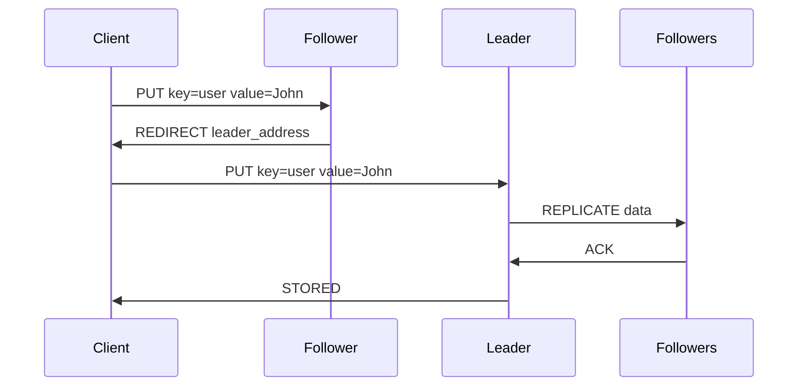
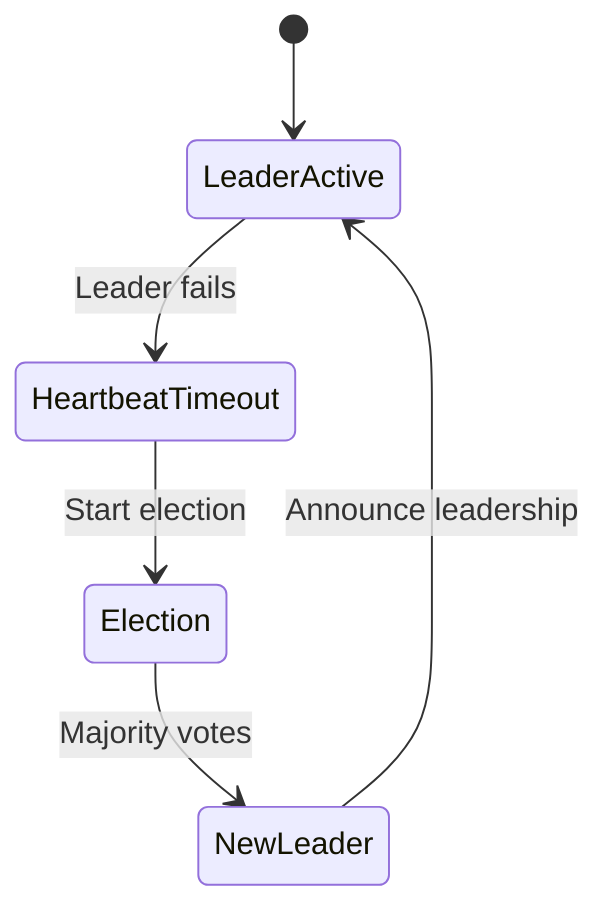

# Resumo Executivo: Implementação Leader-Follower

## 🎯 Objetivo

Implementar um modo **leader-follower** no sistema KV-Store distribuído, mantendo **100% de compatibilidade** com o funcionamento atual (modo leaderless).

## 🔄 Abordagem de Implementação

### Compatibilidade Garantida
- **Modo padrão**: Sistema continua funcionando exatamente como hoje
- **Novo parâmetro**: `--mode=leader-follower` para ativar o novo modo
- **Zero breaking changes**: Código existente não é modificado

### Arquitetura Proposta

```bash
# Modo atual (mantido)
./server node1 8081

# Novo modo
./server node1 8081 --mode=leader-follower
```

## 📋 Principais Modificações

### 1. **Configuração Flexível**
```go
type Config struct {
    Mode              OperationMode  // leaderless | leader-follower
    ElectionTimeout   time.Duration  // 5s
    HeartbeatInterval time.Duration  // 1s
}
```

### 2. **Interface de Modo**
```go
type OperationMode interface {
    Put(key, value string) error
    Get(key string) (string, *VectorClock, bool)
    IsWriteAllowed() bool
    IsReadAllowed() bool
}
```

### 3. **Duas Implementações**
- **LeaderlessMode**: Comportamento atual (gossip, eventual consistency)
- **LeaderFollowerMode**: Novo comportamento (leader election, strong consistency)

## 🔀 Diferenças Comportamentais

| Operação | Modo Leaderless | Modo Leader-Follower |
|----------|----------------|---------------------|
| **PUT** | Qualquer nó aceita | Apenas leader aceita |
| **GET** | Qualquer nó aceita | Qualquer nó aceita |
| **Consistência** | Eventual | Forte para writes |
| **Redirecionamento** | Não | Followers → Leader |
| **Eleição** | Apenas coordenação | Crítica para operação |

## 🔧 Componentes Novos

### 1. **Leader Election**
- Algoritmo baseado em Raft
- Timeout configurável
- Automatic failover

### 2. **Heartbeat System**
- Leader envia heartbeats periódicos
- Followers monitoram timeout
- Trigger para nova eleição

### 3. **Write Replication**
- Leader replica para followers
- Confirmação de maioria
- Hinted handoff para nós offline

## 📊 Fluxos de Operação

### PUT em Modo Leader-Follower


### Failover Automático


## 🚀 Plano de Implementação

### **Fase 1: Estruturas Base** (1 semana)
- [ ] Config system
- [ ] OperationMode interface
- [ ] Estruturas estendidas

### **Fase 2: Leader Election** (2 semanas)
- [ ] Election algorithm
- [ ] Heartbeat system
- [ ] Failover logic

### **Fase 3: Operation Modes** (1 semana)
- [ ] LeaderlessMode (wrapper atual)
- [ ] LeaderFollowerMode (nova lógica)
- [ ] Integration testing

### **Fase 4: Finalização** (1 semana)
- [ ] Scripts de teste
- [ ] Documentação
- [ ] Performance validation

## ✅ Benefícios

### **Flexibilidade**
- Dois modos para diferentes necessidades
- Migração gradual possível
- Rollback simples

### **Casos de Uso**
- **Leaderless**: Alta disponibilidade, particionamento de rede
- **Leader-Follower**: Consistência forte, aplicações críticas

### **Compatibilidade**
- Sistema atual funciona sem alterações
- Deployment incremental
- Zero downtime migration

## 🧪 Validação

### **Testes Automáticos**
```bash
./scripts/test-leaderless.sh      # Valida modo atual
./scripts/test-leader-follower.sh # Valida novo modo
./scripts/test-failover.sh        # Valida eleição
```

### **Métricas**
- Tempo de eleição
- Throughput de writes
- Latência de replicação
- Availability durante failover

## 📈 Impacto Esperado

### **Performance**
- **Leaderless**: Sem overhead
- **Leader-Follower**: ~10-15% overhead por consistência

### **Consistência**
- **Leaderless**: Eventual (atual)
- **Leader-Follower**: Strong para writes

### **Disponibilidade**
- **Leaderless**: Muito alta
- **Leader-Follower**: Alta (dependente de maioria)

## 🎯 Conclusão

A implementação proposta oferece:

1. **Zero breaking changes** - sistema atual intocado
2. **Flexibilidade de deployment** - escolha de modo por parâmetro
3. **Casos de uso ampliados** - consistency vs availability
4. **Migração segura** - rollback instantâneo
5. **Arquitetura limpa** - interfaces bem definidas

A solução permite que diferentes deployments escolham o modo mais apropriado para suas necessidades específicas, mantendo a simplicidade e robustez do sistema atual.
